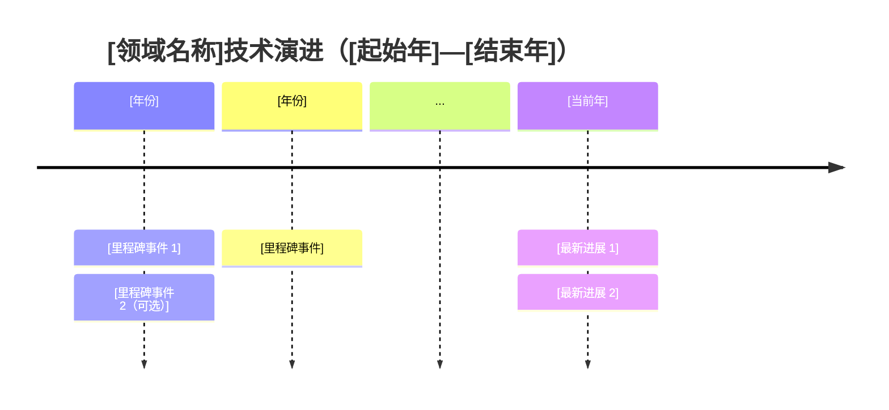
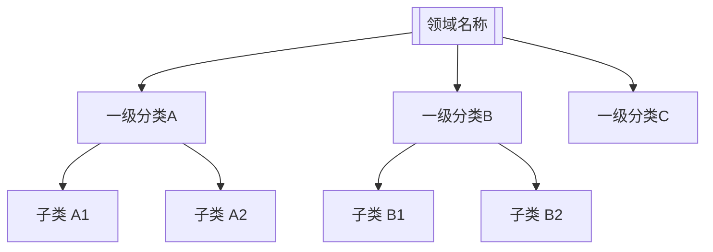

# SciSurvey — Systematic Survey × Sciverse

> **SciSurvey** = **Sci**verse 专属深度检索 × **Systematic Survey** 方法论
>
> "Survey 是逛超市把所有商品分类记下来；Review 是测评博主挑三款深度试用告诉你哪个好。SciSurvey 两者皆能，且都有学术严谨性保障。"

## 快速参数（执行前声明）

在启动综述前，确认以下参数（用户不指定则按领域自动推断）：

| 参数 | 选项 | 自动推断规则 | 说明 |
|------|------|------------|------|
| `--type` | `systematic-survey` / `systematic-review` / `scoping-review` / `narrative-review` | CS/AI/工程 → `systematic-survey`；医学/心理/社科 → `systematic-review`；新兴/交叉领域 → `scoping-review` | 综述类型，决定结构和关键词策略 |
| `--format` | `markdown` / `latex` / `docx` / `pdf` | `markdown` | 最终输出格式 |
| `--citation-style` | `gbt` / `apa` / `ieee` / `vancouver` / `chicago` / `mla` | CS → `ieee`；医学 → `vancouver`；社科 → `apa`；中文 → `gbt` | 参考文献格式 |

> **用法示例：**
> - `大语言模型幻觉检测综述` → 自动推断：`--type systematic-survey --citation-style ieee`
> - `抑郁症认知行为疗法综述 --type systematic-review --citation-style apa --format docx`
> - `元宇宙应用场景调研 --type scoping-review`

---

## Survey vs Review：类型选择指南

| 类型 | 核心动作 | 适用领域 | 典型标题 | SciSurvey 输出结构 |
|------|---------|---------|---------|------------------|
| **Systematic Survey** | 普查式分类 + 横向对比 | CS / AI / 工程 / 跨领域方法论 | "A Survey of X" / "X: A Comprehensive Survey" | Taxonomy → 方法分类详解 → 比较表 |
| **Systematic Review** | 批判性评价 + 深度判断 | 医学 / 心理学 / 教育 / 社会科学 | "A Systematic Review of X" / "X: A Critical Review" | PRISMA → 历史脉络 → 核心争论 → 批判分析 |
| **Scoping Review** | 摸清领域边界，宽松纳入 | 新兴领域 / 跨学科 | "A Scoping Review of X" | 领域地图 → 研究分布 → 空白识别 |
| **Narrative Review** | 传统叙述，无严格筛选 | 经验分享 / 教学 | "X: An Overview" | 主题叙述 → 关键论点 |

> **Survey vs Review 核心判断：**
> - 问"**有哪些方法？各自优缺点？**" → `systematic-survey`
> - 问"**这领域到哪了？接下来往哪走？**" → `systematic-review`
> - 问"**这领域边界在哪？有哪些子方向？**" → `scoping-review`

---

## 概述

本 skill（**SciSurvey**）利用 Sciverse MCP 服务器，根据用户主题自动识别学科领域和综述类型，采用领域自适应关键词策略进行系统性文献检索，输出结构化、可投稿级别的学术综述，支持多格式导出和六种国际标准引用格式。

### 可用 Sciverse 工具

| 工具 | 用途 |
|------|------|
| `mcp__sciverse__list_catalog` | **meta-catalog**：获取所有可过滤/排序字段的完整 schema，含枚举取值样本。用于确认字段名、操作符，避免后续检索参数错误 |
| `mcp__sciverse__search_papers` | **meta-search**：结构化精确检索，支持 `filters_advanced` 任意字段过滤（引用量、语言、FWCI、OA 状态等），返回丰富元数据 |
| `mcp__sciverse__semantic_search` | **agentic-search**：自然语言语义检索，返回相关文献片段（RAG 模式），适合宽泛主题发现 |
| `mcp__sciverse__read_content` | **content**：按字节范围读取文献全文（最大 16384 字节/次），结合 `next_offset` / `more` 字段分段读完 |
| `mcp__sciverse__get_resource` | 读取 `read_content` Markdown 中引用的图片/表格（`` 占位符） |

### 关键元数据字段速查（search_papers 默认返回）

| 字段 | 类型 | 用途 |
|------|------|------|
| `doc_id` | String | 唯一标识符，用于去重和 read_content |
| `title` / `abstract` | String | 标题/摘要，可 BM25 全文搜索 |
| `language` | String | 资源语言（`zh`/`en` 等），**filterable**，用于国内/国际分层 |
| `author` | List[string] | 作者列表，**filterable** |
| `publication_published_year` | Integer | 发表年份，**filterable + sortable** |
| `publication_venue_name` | String | 期刊/会议名，**filterable** |
| `publication_venue_type` | String | 载体类型（journal/conference），**filterable** |
| `publication_venue_biblio_volume/issue/pages` | String | 卷/期/页码（非默认，需 filters_advanced 请求） |
| `publication_published_country` | List[string] | 发表国家，**filterable**，用于国内文献识别 |
| `keywords` | List[string] | 关键词列表，**filterable + searchable** |
| `citation_count` | Integer | 被引次数，**filterable + sortable** |
| `influential_citation_count` | Integer | 高影响力被引次数，**filterable + sortable** |
| `fwci` | Float | 领域加权引用影响力，**filterable + sortable** |
| `citation_normalized_percentile` | Object | 同类型/年份/领域被引百分位，质量评估核心指标 |
| `cited_by_percentile_year` | Object | 按年份细分的被引百分位（min/max，越高越优秀） |
| `references` | List[string] | 本文引用的文献 doc_id 列表，**用于引用链追踪** |
| `related_works` | List[string] | 本文相关工作 doc_id 列表，**用于相关文献扩展** |
| `access_is_oa` / `access_oa_url` | String | 开放获取状态及 URL，**指导全文读取优先级** |
| `doi` | String | DOI，用于参考文献格式化 |

---

## 执行流程（8 阶段，全自动）

---

### 阶段 0 — Meta-Catalog 确认（每次综述开始前必执行）

**目标：** 确认字段 schema，避免后续检索参数错误。

```
mcp__sciverse__list_catalog(include_sample_values=true)
```

从返回结果中确认：
- `language` 字段的实际枚举值（如 `zh`、`en`、`chinese`、`english`）
- `publication_venue_type` 的枚举值
- `access_oa_status` 的枚举值
- `metadata_type` 的枚举值（paper / ebook）

> 若 list_catalog 返回与预期不同的枚举值，**必须**用实际值替换后续检索中的过滤条件。

---

### 阶段 1 — 领域识别、类型推断与检索策略规划

**目标：** 识别学科领域，推断综述类型，构建领域自适应的中英双语检索关键词矩阵。

#### 1.1 学科领域识别

根据用户输入的主题关键词，识别所属学科领域（可多选）：

| 领域代码 | 学科范围 | 典型主题词 |
|---------|---------|----------|
| `CS/AI` | 计算机科学、人工智能、机器学习、NLP、CV | neural network / LLM / algorithm / model / dataset |
| `BioMed` | 医学、生物学、临床研究、药学、公共卫生 | clinical trial / patient / treatment / disease / therapy |
| `PsychSoc` | 心理学、社会学、教育学、行为科学 | behavior / cognitive / intervention / outcome / scale |
| `EngrPhys` | 工程学、物理学、材料科学、化学 | design / experiment / simulation / material / performance |
| `EconMgmt` | 经济学、管理学、金融 | market / firm / policy / regression / panel data |
| `HumLang` | 人文、历史、语言学、文学 | discourse / narrative / cultural / historical / text |
| `Interdis` | 跨学科、新兴领域 | 无固定词汇，综合多领域特征 |

#### 1.2 综述类型自动推断

基于领域代码 + 用户意图，推断 `--type`：

```
领域 = CS/AI / EngrPhys  →  --type systematic-survey  （方法多，需分类对比）
领域 = BioMed / PsychSoc →  --type systematic-review  （有RCT/干预，需PRISMA）
领域 = Interdis / 新兴   →  --type scoping-review     （先摸清边界）
领域 = EconMgmt / HumLang →  --type narrative-review  （叙述为主）

用户明确说"全面调研/有哪些方法"  → systematic-survey
用户明确说"深度分析/批判性评价"  → systematic-review
用户明确说"领域地图/摸清边界"    → scoping-review
```

> 推断结果须向用户确认，用户可覆盖。

#### 1.3 领域自适应关键词矩阵

**核心原则：** 不同领域习惯用不同词描述综述文献，检索时必须匹配领域惯例。

##### CS/AI 领域（`systematic-survey` 主导）

```
英文综合词（优先 survey）：
  "[topic] survey"
  "[topic] comprehensive survey"
  "[topic] taxonomy"
  "[topic] overview"
  "[topic] benchmark"
  "survey of [topic]"

英文语义检索组：
  "[core term] methods approaches techniques"
  "[core term] deep learning neural network"
  "[core term] evaluation benchmark dataset"
  "[core term] recent advances 2023 2024 2025"

中文检索组：
  "[核心词]综述"
  "[核心词]方法分类"
  "[核心词]进展"

典型期刊/会议关键词补充：
  NeurIPS / ICLR / ICML / ACL / EMNLP / CVPR / ICCV / ACM Computing Surveys / IEEE TPAMI
```

##### 医学/生物（`systematic-review` 主导）

```
英文综合词（优先 review + PRISMA 词汇）：
  "[topic] systematic review"
  "[topic] meta-analysis"
  "[topic] randomized controlled trial"
  "[topic] clinical trial"
  "[topic] evidence-based"
  "[topic] Cochrane review"

英文语义检索组：
  "[condition] treatment intervention outcomes"
  "[condition] efficacy safety adverse effects"
  "[condition] epidemiology prevalence incidence"
  "PRISMA [topic] inclusion exclusion criteria"

中文检索组：
  "[核心词]系统综述"
  "[核心词]荟萃分析"
  "[核心词]临床研究"
  "[核心词]随机对照试验"

典型期刊关键词：
  Cochrane / NEJM / Lancet / BMJ / JAMA / PubMed / Clinical Trial
```

##### 心理学/社会科学（`systematic-review` 主导）

```
英文综合词：
  "[topic] systematic review"
  "[topic] meta-analysis"
  "[topic] critical review"
  "[topic] scoping review"
  "[topic] literature review"

英文语义检索组：
  "[construct] measurement scale validity reliability"
  "[intervention] effect size Cohen's d"
  "[topic] qualitative quantitative mixed methods"
  "[topic] longitudinal cross-sectional"

中文检索组：
  "[核心词]系统综述"
  "[核心词]实证研究"
  "[核心词]量表测量"

典型期刊关键词：
  Psychological Bulletin / Psychological Review / Annual Review of Psychology
```

##### 工程/物理（`systematic-survey` 主导）

```
英文综合词：
  "[topic] review"
  "[topic] state of the art"
  "[topic] recent progress"
  "[topic] advances"
  "[topic] comprehensive review"

英文语义检索组：
  "[topic] performance comparison experimental"
  "[topic] fabrication synthesis method"
  "[topic] simulation modeling"
  "[topic] application industrial"
```

##### 经济/管理（`narrative-review` / `scoping-review`）

```
英文综合词：
  "[topic] literature review"
  "[topic] research agenda"
  "[topic] bibliometric analysis"
  "[topic] systematic literature review"

英文语义检索组：
  "[topic] empirical evidence panel data"
  "[topic] theory framework model"
  "[topic] institutional policy"
```

##### 人文/语言学（`narrative-review`）

```
英文综合词：
  "[topic] review"
  "[topic] overview"
  "[topic] critical perspective"
  "[topic] discourse analysis"

英文语义检索组：
  "[topic] corpus analysis text"
  "[topic] historical development evolution"
  "[topic] theoretical framework"
```

#### 1.4 构建本次综述的实际关键词矩阵

结合 1.3 中对应领域的词组 + 用户主题，生成：

```
中文语义检索组（3-5 组，根据领域选词）：
  [核心词], [核心词+领域惯用综述词], [核心词+方法/干预/模型], [核心词+评测/效果], [核心词+挑战/展望]

英文语义检索组（4-6 组）：
  [core term + 领域惯用综述词（survey/review/meta-analysis）]
  [core term + method/approach/technique]
  [core term + evaluation/benchmark/experiment]
  [core term + application/clinical/industrial]
  [core term + recent advances + 近2年年份]

meta-search BM25 关键词（精简，1-3 词）：
  [最小化核心词组，不加修饰词]
```

3. 规划检索轮次（见阶段 2 详述）

---

### 阶段 2 — 多策略并行文献检索

**目标：** 通过语义检索 + meta-search 结构化检索 + 引用链追踪三路并行，覆盖 80+ 篇候选文献。

> **执行原则：** 不同轮次之间尽量并行（在同一 response 中多次调用），节省时间。

---

#### 2.1 语义检索（英文，agentic-search 路线）

对每组英文关键词，调用：
```
mcp__sciverse__semantic_search(
  query="<英文关键词组>",
  mode="quality",    # LLM 改写 + 混合检索，最高质量
  top_k=20
)
```
至少执行 **4 组**不同角度的英文语义检索（主题/方法/应用/评测各一组）。

返回字段重点记录：`doc_id`、`title`、`chunk`（文摘片段）、`score`（相关性得分）、`offset`（用于后续 read_content 定位）。

---

#### 2.2 语义检索（中文，agentic-search 路线）

```
mcp__sciverse__semantic_search(
  query="<中文关键词组>",
  mode="quality",
  top_k=15
)
```
至少执行 **3 组**中文语义检索。

---

#### 2.3 结构化 Meta-Search（search_papers 路线）

> ⚠️ **关键约束：`query` 与 `sort_by_year` 互斥**
> Sciverse 后端不允许 BM25 全文检索（`query` 参数）与显式年份排序同时使用。
> **规则：只要传了 `query`，`sort_by_year` 必须设为 `"none"`，否则返回 `INVALID_REQUEST`。**
> 若需要按年排序，删除 `query` 参数，改用 `filters_advanced` 做内容过滤（如 `title CONTAINS`）。

使用 `filters_advanced` 覆盖下列 6 类精确检索，每类都能发现语义检索遗漏的文献：

**① 高引用量奠基性文献（landmark papers）**
```
mcp__sciverse__search_papers(
  query="<核心英文关键词>",
  year_from=2015,
  sort_by_year="none",          # 不按年排序，让 BM25 相关性主导
  filters_advanced=[
    {"field": "citation_count", "operator": "FILTER_OP_GTE", "value": 200},
    {"field": "metadata_type", "operator": "FILTER_OP_EQ", "value": "paper"}
  ],
  page_size=30
)
```

**② 高 FWCI 高影响力文献（跨领域质量保障）**
```
mcp__sciverse__search_papers(
  query="<核心英文关键词>",
  year_from=2018,
  sort_by_year="none",          # 不按年排序，让 BM25 相关性主导（query + sort_by_year="desc" 会触发 INVALID_REQUEST）
  filters_advanced=[
    {"field": "fwci", "operator": "FILTER_OP_GTE", "value": 2.0},
    {"field": "influential_citation_count", "operator": "FILTER_OP_GTE", "value": 1}
  ],
  page_size=20
)
```

**③ 国内中文文献（language 过滤）**
```
mcp__sciverse__search_papers(
  query="<核心关键词（可中英文）>",
  year_from=2018,
  sort_by_year="none",          # 不按年排序，让 BM25 相关性主导
  filters_advanced=[
    {"field": "language", "operator": "FILTER_OP_IN", "value": ["zh", "chinese"]}
  ],
  page_size=30
)
```
> 若中文文献不足，补充用 `publication_published_country CONTAINS "China"` 过滤

**④ 中国机构英文发表文献（补充国内研究）**
```
mcp__sciverse__search_papers(
  query="<核心英文关键词>",
  year_from=2019,
  sort_by_year="none",          # 不按年排序，让 BM25 相关性主导
  filters_advanced=[
    {"field": "publication_published_country", "operator": "FILTER_OP_CONTAINS", "value": "China"},
    {"field": "language", "operator": "FILTER_OP_EQ", "value": "en"}
  ],
  page_size=20
)
```

**⑤ 最新前沿文献（近 2 年）**
```
mcp__sciverse__search_papers(
  query="<核心关键词>",
  year_from=<current_year - 2>,
  sort_by_year="none",          # 不按年排序，让 BM25 相关性主导
  filters_advanced=[
    {"field": "citation_count", "operator": "FILTER_OP_GTE", "value": 3}
  ],
  page_size=25
)
```

**⑥ 开放获取文献（优先可读全文）**
```
mcp__sciverse__search_papers(
  query="<核心英文关键词>",
  year_from=2020,
  sort_by_year="none",          # 不按年排序，让 BM25 相关性主导
  filters_advanced=[
    {"field": "access_is_oa", "operator": "FILTER_OP_EQ", "value": "true"},
    {"field": "citation_count", "operator": "FILTER_OP_GTE", "value": 20}
  ],
  page_size=20
)
```

---

#### 2.4 引用链追踪（citation graph expansion）

**目标：** 从高质量文献的 `references` 和 `related_works` 字段出发，发现关键词检索遗漏的奠基性文献。

**步骤：**

1. 从阶段 2.1-2.3 的结果中，选取 `citation_count` 最高的 Top-10 文献
2. 提取它们的 `references` 列表（doc_id 数组），合并去重，统计每个 doc_id 出现频次
3. 出现频次 ≥ 3 的 doc_id 为高度被引用的奠基论文，通过 search_papers 获取其元数据：
```
mcp__sciverse__search_papers(
  filters_advanced=[
    {"field": "doc_id", "operator": "FILTER_OP_IN", "value": ["<doc_id_1>", "<doc_id_2>", ...]}
  ],
  page_size=20
)
```
4. 同理处理 `related_works` 字段，扩展相关文献图谱

> **说明：** 引用链追踪是发现综述领域奠基性论文（通常年代较早、引用极高）的最可靠方法，弥补关键词检索对经典文献的系统性遗漏。

---

#### 2.5 记录检索过程（PRISMA 方法学）

维护内部检索记录表：

| 检索轮次 | 策略 | 关键词/过滤条件 | 命中数 | 纳入候选数 |
|---------|------|----------------|--------|-----------|
| 2.1-EN-1 | 语义 | ... | | |
| 2.1-EN-2 | 语义 | ... | | |
| 2.3-①  | meta-search 高引 | citation_count≥200 | | |
| 2.4 | 引用链追踪 | Top-10 references | | |

---

### 阶段 3 — 质量过滤、去重与分类

**目标：** 从 80+ 候选文献中筛选出 40-60 篇高质量、无重复文献，并正确分层为国内/国际。

#### 3.1 去重（按 doc_id）

- 以 `doc_id` 为主键去重；重复文献保留元数据最完整的记录
- 合并同文献不同检索路径的信息（如 semantic_search 的 chunk 片段 + search_papers 的完整元数据）

#### 3.2 质量评分

每篇文献综合以下指标计算质量得分，用于优先级排序：

| 指标 | 说明 | 权重 |
|------|------|------|
| `citation_count` | 绝对被引量，按年龄调整 | 高 |
| `fwci` | 领域加权影响力（>1.0 为高于均值，>2.0 为顶尖） | 高 |
| `influential_citation_count` | 高影响力被引（>0 为里程碑论文） | 高 |
| `cited_by_percentile_year.max` | 同年文献中的百分位（>90 为顶尖） | 中 |
| `citation_normalized_percentile` | 同类型/年份/领域被引百分位 | 中 |
| `access_is_oa` | 开放获取（可读全文加分） | 低 |

**年龄调整引用量阈值（最低纳入线，可动态降低保证覆盖度）：**

| 发表距今 | 最低 citation_count | 最低 fwci |
|---------|---------------------|----------|
| 0-1 年  | ≥ 2（允许最新成果） | 任意 |
| 1-2 年  | ≥ 8               | ≥ 0.5   |
| 2-5 年  | ≥ 30              | ≥ 1.0   |
| 5-10 年 | ≥ 100             | ≥ 1.2   |
| 10 年以上| ≥ 300            | ≥ 1.5   |

> 若高阈值后文献总量 < 20 篇，适当降低阈值并在综述方法节说明。

#### 3.3 国内/国际分类（三重判断逻辑）

按优先级依次判断：

1. **`language` 字段** = `zh`/`chinese` → 国内文献
2. **`publication_published_country` 字段** 包含 `China`/`People's Republic of China` → 国内文献（含中国机构英文发表）
3. **`author` 字段**中存在中文姓名 或 所属机构含中国机构关键词（北京大学/清华/中科院/Peking/Tsinghua/CAS 等） → 国内文献

满足任一条件即归为国内文献；三者均不满足则为国际文献。

**目标分布：**
- 国内文献：15-25 篇
- 国际文献：25-40 篇
- 总计：40-60 篇

---

### 阶段 4 — 深度元数据提取与全文读取

**目标：** 充分利用默认返回的丰富元数据，并对高优先级文献进行全文精读。

#### 4.1 元数据深度提取

对所有纳入文献，从 search_papers 返回结果中系统提取：

```
【元数据卡片】
doc_id：
标题（title）：
作者（author，前 3 位）：
发表年份（publication_published_year）：
期刊/会议（publication_venue_name）：
载体类型（publication_venue_type）：
语言（language）：
发表国家（publication_published_country）：
关键词（keywords）：
DOI（doi）：
被引量（citation_count）：
高影响被引（influential_citation_count）：
FWCI（fwci）：
同年被引百分位（cited_by_percentile_year.max）：
开放获取（access_is_oa / access_oa_url）：
引用文献数（reference_count）：
本文引用列表（references，前 10 个 doc_id）：   ← 用于引用链追踪
相关工作列表（related_works，前 10 个 doc_id）：  ← 用于相关文献扩展
```

#### 4.2 选取精读文献（全文 read_content）

精读优先级：
1. `influential_citation_count > 0` 的所有文献（里程碑论文，必读）
2. `fwci > 3.0` 的顶尖影响力文献
3. 按 `cited_by_percentile_year.max` 降序，国内 Top-12、国际 Top-18

**OA 优先策略：**
- 优先选取 `access_is_oa = "true"` 的文献进行全文读取（可获取完整正文）
- 非 OA 文献通过 `read_content` 尝试读取（可能仅有摘要/已收录内容）

**doc_id 格式与全文可读性：**
- **哈希格式 doc_id**（如 `c5568f8a703c...`）：来自 `semantic_search` 返回，Sciverse 已建立全文索引，`read_content` 成功率高 → **优先精读**
- **DOI 格式 doc_id**（如 `paper:10.1007/s10639-024-12949-9`）：来自 `search_papers` 返回，全文爬取覆盖率不完整，`read_content` 可能返回 502 → **降低优先级**
- 精读候选列表中，哈希格式 doc_id 排在 DOI 格式 doc_id 之前

**`retrieve_content_failed`（502）快速跳过规则：**
- `read_content` 返回 502 → **立即标记该文献为"仅摘要"，不重试**，继续处理下一篇
- 仅摘要文献的处理见 4.4 精读卡片顶部注释要求：写作时不引用任何具体数字

#### 4.3 全文读取策略

```
# 第一段：最大字节读取（含摘要、引言、方法核心段落）
mcp__sciverse__read_content(
  doc_id="<doc_id>",
  offset=0,
  limit=16384   # 使用最大限制，获取尽可能多的内容
)

# 若 more=true，继续读取关键章节（结论/实验/讨论）
mcp__sciverse__read_content(
  doc_id="<doc_id>",
  offset=<next_offset>,  # 使用上一次返回的 next_offset
  limit=16384
)

# 若 more 仍为 true，读取最后章节（结论/参考文献附近）
mcp__sciverse__read_content(
  doc_id="<doc_id>",
  offset=<next_offset>,
  limit=8192
)
```

> 对于精读文献，**至少读取前两段**（前 32768 字节），确保覆盖摘要、引言、主要方法章节。

#### 4.4 全文信息提取模板

```
【文献精读卡片】
doc_id：                              ← 必填，用于后续证据映射
标题（来自 title 字段，原文）：
作者（来自 author 字段，前 3 位）：    ← 只写元数据实际返回的名字，不推测
通讯作者机构（来自全文或摘要）：
发表年/期刊：
卷/期/页码（来自 publication_venue_biblio_* 字段或全文）：
citation_count / fwci / influential_citation_count：
cited_by_percentile_year.max：
DOI（来自 doi 字段，原文）：
---
研究问题：（全文中提取的原始问题描述，加引号标注原文出处段落）
核心方法名称：（从全文确认的正式方法名，注意区分缩写与全称）
核心方法描述：（2-3句，来自方法章节，非摘要推测）
主要实验结果（含5要素）：
  指标名称：
  数据集名称：
  对比基线（baseline model）：
  本方法结果：
  提升幅度：
  → 全文原文位置（offset 范围）：
数据集/基准（名称 + 规模）：
作者自述局限性（原文引用）：
模型访问类型：□ 黑盒（无内部访问）□ 白盒（需 logits/hidden states）□ 灰盒（仅需解码）
训练要求：□ 无需训练 □ 推理时调整 □ 需微调 □ 需完整训练
计算成本估计（作者报告或可推断）：
与综述主题的关联维度：
```

> **严格约束：** 精读卡片中的所有字段必须来自 `read_content` 实际返回的文本，或元数据字段的原文。**禁止**从文献标题/摘要推测方法细节、实验数据、作者机构。若全文不可读（read_content 返回空或极少），在卡片顶部注明"仅摘要"，并将该文献在综述正文中的描述严格限制在摘要范围内，**不引用任何数字**。

---

### 阶段 4.5 — 引用证据映射（Citation Evidence Mapping）⚠️ 必执行

**目标：** 为每一条将写入综述正文的 claim（特别是：方法名、作者归属、实验数字）建立显式的文献证据记录，阻断"合理推测"式写作。

#### 4.5.1 建立证据映射表

在开始写作（阶段 6）之前，逐篇构建证据映射：

```
【证据映射表】（每条正文 claim 一行）

| 拟写的 claim（正文中要说的话） | 对应 doc_id | 证据来源 | 全文原文节选（20-50字） | 证据可信度 |
|-------------------------------|------------|---------|------------------------|-----------|
| "X 等提出 Y 方法，在 Z 数据集上提升了 N%" | doc_xxx | read_content offset=A | "...原文..." | 高/中/低 |
| "A 方法适用于黑盒模型" | doc_yyy | 摘要/方法章节 | "...原文..." | 高/中/低 |
```

**证据可信度判定规则：**
- **高**：claim 在全文方法章节或实验章节有直接文本支撑（read_content 读到）
- **中**：claim 仅有摘要支撑，或需要轻微解释才能对应
- **低**：claim 来自标题/关键词推测，无全文证据

> **写作规则：** 证据可信度为"低"的 claim **不得写入正文**；为"中"的 claim 须降级为"据摘要描述"并注明不确定性，**不得引用具体数字**。

#### 4.5.2 方法归属验证清单

在综述中首次提及某方法时，必须完成以下核查：

```
□ 方法名（缩写/全称）与 read_content 中一致？
□ 作者姓名与 author 字段一致（不是从标题/其他文献推测的）？
□ 该方法确实在这篇论文中"提出"，而非只是被引用？
□ 若引用实验数字（N%），已确认：指标名 / 数据集名 / baseline 模型名 / 原文段落？
□ 若描述适用场景（黑盒/白盒/成本），有全文依据或有合理推断说明？
```

**任一项未通过 → 暂停写作，补充 read_content → 重新填写精读卡片后再写。**

#### 4.5.3 数字引用五要素规则

综述正文中出现任何百分比、分数、排名等数字时，**必须同时标注五要素**（可内嵌于括号中）：

> 格式：**[数字]**（指标：[M]；数据集：[D]；对比基线：[B]；来源：[参考文献号]）

例：
- ✅ "DoLa 在 TruthfulQA MC1 子集上达到 57.2%（指标：准确率；数据集：TruthfulQA；对比基线：LLaMA-7B 标准解码；来源：[11]）"
- ❌ "DoLa 将 LLaMA 的准确率提升了约 12%"（缺指标、数据集、基线，不可写入）

**若五要素不完整，删除该数字，改为定性描述（"显著提升"、"作者报告有所改善"）并注明原因。**

---

### 阶段 5 — 主题聚类与综合分析

**目标：** 以主题而非文献为轴心，整合元数据统计与内容分析，识别国内外差异，并构建技术演进图谱。

#### 5.0 技术演进图谱构建（必执行，放入第 3 节）

**目标：** 为初学者提供该领域从萌芽到当前的全局视野，以时间轴可视化呈现关键转折点。

**构建步骤：**

1. 从所有纳入文献的元数据和全文中，提取以下类型的**里程碑事件**：
   - 领域奠基/提出核心概念的论文（`influential_citation_count > 0` 优先）
   - 代表性方法/模型首次提出
   - 重要基准数据集发布
   - 标志性综述/调研出版
   - 近 2 年的突破性进展（高 fwci）

2. 按 `publication_published_year` 排列，每年选取 1-3 个最关键事件，控制总节点数在 **10-20 个**。

3. 用 **Mermaid timeline** 语法生成图谱（Markdown 原生支持，无需额外工具）：



4. **每个里程碑节点必须对应纳入文献列表中的具体文献**（在节点描述后括注参考文献编号），若对应文献不在列表中则不列入图谱。

5. 在图谱下方附"关键转折点注释表"：

| 年份 | 事件 | 意义 | 参考文献 |
|------|------|------|---------|
| 20XX | [方法/概念名] | [1-2句话说明为何是转折点] | [n] |

**演进图谱放置位置：**
- `systematic-survey` → 放在第 3 节"技术演进图谱"
- `systematic-review` → 放在第 2 节"领域发展脉络"开头
- `scoping-review` → 放在第 3 节"领域全景图"中

#### 5.1 元数据统计分析（量化视角）

在聚类前，先从元数据角度生成量化描述：

- **年份分布**：按 `publication_published_year` 统计，绘制趋势（是否加速增长？）
- **期刊/会议分布**：按 `publication_venue_name` 统计 Top-10 发表载体
- **语言/国家分布**：量化国内（中文 + 中国机构英文）vs. 国际比例
- **高影响文献**：`influential_citation_count > 0` 的文献列表及所属主题
- **关键词共现**：从所有文献的 `keywords` 字段提取高频词（出现 ≥ 3 次的词），作为主题聚类的初始依据

#### 5.2 主题聚类（3-7 个主题）

基于关键词共现分析 + 全文内容，归纳研究主题：

典型维度（根据实际研究领域调整）：
- **理论/分类框架**：定义、分类、成因分析
- **方法/技术路线**：核心算法、模型架构、技术创新
- **评测/基准体系**：数据集构建、评估指标、对比实验
- **应用/垂直场景**：特定领域落地
- **新兴前沿**：近 2 年高 fwci 文献集中的新方向

#### 5.3 国内外对比矩阵

| 维度 | 国内研究特点 | 国际研究特点 | 差距/互补 |
|------|------------|------------|---------|
| 研究重点 | | | |
| 方法论 | | | |
| 数据资源 | | | |
| 应用场景 | | | |
| 发表载体 | | | |
| 被引影响（平均 fwci） | | | |

#### 5.4 研究空白识别

基于以下信号识别：
- **高被引文献的"未来工作"段落**（全文提取）
- **`references` 交叉分析**：多篇文献共同引用但本次检索未纳入的论文（补充检索）
- **关键词矩阵中无文献覆盖的子方向**

---

### 阶段 6 — 综述写作

**目标：** 根据 `--type` 参数选择对应结构模板，生成完整、规范的学术综述。

#### 6.0 按 `--type` 选择输出结构

```
--type systematic-survey  → 使用 6.1A 结构（分类-方法-对比表）
--type systematic-review  → 使用 6.1B 结构（PRISMA-争论-批判分析）
--type scoping-review     → 使用 6.1C 结构（边界-分布-空白图）
--type narrative-review   → 使用 6.1A 简化版（无严格 PRISMA）
```

---

#### 6.1A Systematic Survey 结构（CS/AI/工程，普查式分类）

> 回答"**有哪些方法？各自优缺点是什么？**"
> 标志：技术演进图谱 + 分类体系（Taxonomy）+ 横向比较表
> 读者视角：**面向进入该领域的科研人员**，让他们快速建立全局认知

```
# [研究方向]综述：[副标题]

## 摘要（400-600字：背景、核心发现、分类框架、主要结论、趋势展望）
**关键词：**

## 1. 引言
### 1.1 研究背景与重要性
（回答"这个领域为什么重要？解决什么问题？"——让初学者立刻理解价值）
### 1.2 本综述的范围与结构

## 2. 领域概念框架
### 2.1 核心概念与定义
（给出该领域必须掌握的 3-5 个核心概念，每个配简洁定义和关键文献）
### 2.2 分类体系（Taxonomy）
（用 Mermaid 图或缩进列表呈现方法分类框架；引用高被引综述建立框架）



## 3. 技术演进图谱
（从 Phase 5.0 输出的 Mermaid timeline + 关键转折点注释表）
（让读者在 5 分钟内看懂该领域从哪里来、到了哪里、往哪里去）

## 4. [类别A]：[最重要的子方向]
（面向读者：先用 1-2 段概述该类别解决什么问题、核心思路是什么）
### 4.1 代表性方法
（国内外代表性工作混排，按方法逻辑而非国籍分组；每种方法说明：原理/适用场景/优缺点）
### 4.2 本类别横向比较
| 方法 | 提出者/年 | 模型访问 | 训练要求 | 适用场景 | 核心优势 | 主要局限 | 代表结果 |

## 5. [类别B]：...
（同 4 节结构）

## 6. [类别C]：...

## 7. 全局对比分析
### 7.1 跨类别方法横向比较矩阵
（所有方法按关键维度对比，便于读者选型）
### 7.2 国内外研究格局对比
| 维度 | 国内研究特点 | 国际研究特点 | 互补机会 |

## 8. 研究趋势与前沿方向
（基于近 2 年高 fwci 文献，提炼 3-5 个趋势；每条趋势附具体文献支撑）

## 9. 开放挑战与未来展望
（未解决的核心问题 + 建议研究方向，3-5 点）

## 10. 结论

## 参考文献

---

## 附录 A：文献检索方法
（见 6.1 公共附录模板）

## 附录 B：文献统计摘要与质量自评
（见 Phase 8.4 模板）
```

---

#### 6.1B Systematic Review 结构（医学/心理/社科，批判性评价）

> 回答"**这个领域到哪了？哪些结论可信？接下来往哪走？**"
> 标志：领域发展脉络（含演进图谱）+ 核心争论 + 批判性分析
> 读者视角：**面向科研人员**，优先呈现发现与判断，检索方法移至附录

```
# [研究方向]系统综述：[副标题]

## 摘要（结构化：背景 / 研究问题 / 主要发现 / 结论与建议，各 60-100 字）
**关键词：**

## 1. 引言
### 1.1 研究背景与重要性
（回答"这个问题为什么值得系统综述？当前实践痛点是什么？"）
### 1.2 研究问题（PICO 框架）
  - **P（研究对象）：**
  - **I（干预/暴露）：**
  - **C（对照条件）：**
  - **O（结局指标）：**
### 1.3 本综述的范围与局限说明

## 2. 领域发展脉络
（让读者先建立历史感，再进入具体证据）

### 2.1 技术/理论演进图谱
（Phase 5.0 输出的 Mermaid timeline：奠基理论 → 方法突破 → 当前主流范式）

### 2.2 各阶段特征概述
（每个时期 1-2 段，说明核心转变是什么、哪些研究是里程碑）

## 3. [主题A] — 研究证据综合
（先总述该主题研究现状，再按证据质量和结论一致性组织）
### 3.1 主要发现
### 3.2 证据强度小结（表格）
| 研究 | 设计类型 | 样本量 | 核心结论 | 偏倚风险 |

## 4. [主题B] — 研究证据综合
（同第 3 节结构）

## 5. 核心争论点（Key Debates）
（每条争论：正方证据 [n][n] → 反方证据 [n][n] → 综合判断）

## 6. 批判性分析
### 6.1 证据质量整体评估
### 6.2 方法论局限
### 6.3 发表偏倚风险评估

## 7. 未来研究方向
（基于证据空白 + 方法局限，提出具体可操作的研究问题，3-5 条）

## 8. 结论

## 参考文献

---

## 附录 A：文献检索与筛选方法
（PRISMA 流程、检索策略、纳入/排除标准——见 6.1 公共附录模板）

## 附录 B：纳入文献质量评估与统计
（见 Phase 8.4 模板）
```

---

#### 6.1C Scoping Review 结构（新兴/交叉领域，边界探索）

> 回答"**这个领域的边界在哪？涉及哪些维度？还有哪些没被研究过？**"
> 读者视角：**面向想进入新领域的科研人员**，提供地图式全景认知

```
# [研究方向]范围综述：[副标题]

## 摘要（背景 / 范围界定 / 主要发现 / 研究机会）

## 1. 引言
### 1.1 为什么需要范围综述（领域新兴/边界模糊的依据）
### 1.2 综述范围界定

## 2. 领域全景图
### 2.1 领域演进轨迹
（Mermaid timeline：从哪些母领域交汇而来，重要时间节点）
### 2.2 研究规模与分布
（年份分布图/表；地区分布；发表载体分布）

## 3. 研究维度地图
（有哪些子方向/研究角度——用 Mermaid graph 或表格呈现维度结构）

## 4. 跨学科关联
（与哪些领域交叉？每个交叉方向的代表性研究是什么？）

## 5. 研究空白地图
（哪些维度几乎没有研究？用表格呈现"已探索 vs. 待探索"）
| 维度 | 当前研究密度 | 代表文献 | 空白点描述 |

## 6. 未来研究机会
（可以进一步做 Systematic Review 或实验研究的具体方向，3-5 条）

## 7. 结论

## 参考文献

---

## 附录 A：文献检索与筛选方法
（见 6.1 公共附录模板）

## 附录 B：文献统计摘要
（见 Phase 8.4 模板）
```

---

#### 6.1 公共附录模板：文献检索说明（所有类型通用，置于附录 A）

> **位置说明：** 此内容不出现在正文中，统一放入**附录 A**。面向需要复现检索过程的读者（编辑审稿、同行复现）提供，不影响正文的读者体验。

```
## 附录 A：文献检索与筛选方法

### A.1 检索数据库
Sciverse 学术数据库（多源聚合，覆盖 arXiv、ACL Anthology、PubMed、IEEE Xplore 等；
检索执行日期：[YYYY-MM-DD]）。

### A.2 检索策略

**语义检索关键词组（quality 模式）：**
- EN-1: "[实际查询串 1]"
- EN-2: "[实际查询串 2]"
- ZH-1: "[中文查询串 1]"
（逐一列出实际使用的所有查询串）

**结构化 meta-search 过滤条件：**
- ① 高引奠基文献：citation_count≥[N], year≥[Y]
- ② 高 FWCI：fwci≥2.0, influential_citation_count≥1
- ③ 国内中文：language IN ["zh","chinese"]
- ④ 中国机构英文：country CONTAINS "China", language=en
- ⑤ 最新前沿：year≥[current-2], citation_count≥3
- ⑥ 开放获取：access_is_oa=true, citation_count≥20

**引用链追踪：** 从 Top-[N] 高引文献 references 字段提取高频 doc_id（出现≥3次）

### A.3 纳入/排除标准

| | 标准 |
|--|------|
| **纳入** | 发表年 [起始年]—[结束年]；与主题直接相关；引用量满足年龄调整阈值 |
| **排除** | 主题相关性低；重复发表；纯技术报告；无实验验证的纯理论 |

### A.4 PRISMA 筛选流程

| 阶段 | 数量 |
|------|------|
| 检索总命中（去重前） | X 篇 |
| 去重后候选 | X 篇 |
| 摘要相关性筛选后 | X 篇 |
| 质量阈值过滤后 | X 篇 |
| **最终纳入** | **X 篇（国内 X + 国际 X）** |

年份跨度：[起始年]—[结束年]；中位发表年：[年份]
```

---

#### 6.1D Narrative Review 结构（经验综述/教学概览）

> 面向**需要快速了解一个领域全貌**的读者，风格更轻松，无严格 PRISMA

```
# [研究方向]综述：[副标题]

## 摘要（背景 / 主要发现 / 实践建议）

## 1. 引言
### 1.1 为什么关注这个话题
### 1.2 本综述的覆盖范围

## 2. 领域发展脉络
（Mermaid timeline：关键事件和转折点）

## 3. 核心概念与框架
（定义 + 分类，引用高被引综述建立框架）

## 4. [主题A]研究进展
（国内外混排；每段 2-4 篇文献支撑；禁止逐篇罗列）

## 5. [主题B]研究进展

## 6. 综合讨论与对比分析
（含 5 维度对比矩阵：国内 vs. 国际研究特征）

## 7. 趋势与未来展望

## 8. 结论

## 参考文献

---

## 附录 A：文献检索说明
（见 6.1 公共附录模板）

## 附录 B：文献统计摘要
（见 Phase 8.4 模板）
```

#### 6.2 写作规范

- **读者优先原则：** 正文面向"需要看综述的科研人员"——先给全局视野（演进图谱），再给分类框架，最后给方法细节。检索过程、PRISMA 流程等方法论内容**统一放入附录**，不出现在正文各节。
- **演进图谱必须存在：** 每篇综述正文必须包含至少一个 Mermaid 可视化图（timeline 或 graph），且所有节点必须对应纳入文献列表中的实际文献。图谱节点 10-20 个，聚焦关键转折点而非罗列所有文献。
- **语言：** 客观学术中文；英文文献保留原英文标题，中文描述内容
- **引用格式：** 正文上标 [n] 或 (作者, 年份)；文末 GB/T 7714-2015
- **段落密度：** 每段 150-250 字，包含 2-4 篇文献支撑；**禁止逐篇罗列式**（"A 研究了…；B 研究了…"）
- **量化支撑：** 引用数字必须满足"四.五.三"五要素规则；不满足条件的数字一律删除，改为定性描述
- **正文长度：** 5000-10000 字（根据文献量调整）；附录不计入此字数
- **批判性视角：** 每个方法子章节必须包含以下判断（来自全文证据或合理推断）：
  - 该方法适用于黑盒还是白盒模型？
  - 是否需要额外训练？计算成本如何？
  - 该方法在哪些 benchmark 有效，在哪些场景可能失效？
  - 与同类方法相比的核心优缺点？

#### 6.2.1 技术方法比较表（方法类章节必须包含）

在介绍技术方法的章节（检测方法、缓解方法等），除正文描述外，**必须附一张方法横向比较表**：

```markdown
| 方法名 | 提出者/年份 | 模型访问类型 | 训练要求 | 适用场景 | 核心优点 | 主要局限 | 代表性结果 |
|--------|-----------|------------|---------|---------|---------|---------|-----------|
| SelfCheckGPT | Manakul 2023 | 黑盒 | 无需训练 | 通用生成 | 无需标注数据，即插即用 | 多次采样成本高，不适合低延迟场景 | BERTScore 0.64（WikiBio） |
| DoLa | Chuang 2024 | 灰盒（需 logits） | 无需训练 | 解码阶段 | 零额外参数，直接改善 | 需访问层级 logits，不适用 API 模型 | TruthfulQA MC1 57.2%（LLaMA-7B） |
```

**表格规则：**
- "模型访问类型"只填：黑盒 / 灰盒（需 logits/tokens）/ 白盒（需 hidden states）
- "训练要求"只填：无需训练 / 推理时调整 / 需微调 / 需完整预训练
- "代表性结果"必须包含指标名 + 数据集名，来自证据映射表；无法填写则标注"[全文未报告]"
- 同一类别（检测/缓解/基准）的所有方法必须出现在同一张表中，不允许分散

#### 6.3 参考文献格式模板（按 `--citation-style` 选择）

根据用户声明的 `--citation-style` 参数选择对应格式模板。**所有字段来自 Sciverse 元数据，不编造；缺失字段注明 `[信息不完整]`。**

---

##### 6.3.1 GB/T 7714-2015（`--citation-style gbt`，默认中文综述）

```
# 期刊论文（中文）
[n] 作者1, 作者2, 作者3. 题名[J]. 刊名, 年份, 卷(期): 起止页码. DOI.

# 期刊论文（英文）
[n] AUTHOR1 A B, AUTHOR2 C D. Title[J]. Journal Name, Year, Vol(Issue): Pages. DOI.

# 会议论文
[n] 作者. 题名[C]//会议名称全称. 出版地: 出版者, 年份: 起止页码.

# 预印本（arXiv）
[n] AUTHOR1 A. Title[EB/OL]. arXiv preprint arXiv:XXXX.XXXXX, Year.
    https://arxiv.org/abs/XXXX.XXXXX.
```

---

##### 6.3.2 APA 7th Edition（`--citation-style apa`，默认英文综述）

```
# 期刊论文
[n] Author, A. B., & Author, C. D. (Year). Title of article. Journal Name, Vol(Issue),
    Pages. https://doi.org/xxx

# 会议论文
[n] Author, A. B. (Year). Title of paper. In A. Editor (Ed.), Proceedings title
    (pp. X–XX). Publisher. https://doi.org/xxx

# 预印本（arXiv）
[n] Author, A. B. (Year). Title. arXiv. https://arxiv.org/abs/XXXX.XXXXX
```

> APA 7th 正文引用格式：(Author, Year) 或 Author (Year)

---

##### 6.3.3 IEEE（`--citation-style ieee`，工程/计算机领域推荐）

```
# 期刊论文
[n] A. B. Author and C. D. Author, "Title of article," Abbrev. Journal Name,
    vol. X, no. Y, pp. X–XX, Mon. Year, doi: 10.xxxx/xxxxx.

# 会议论文
[n] A. B. Author, "Title of paper," in Proc. Conf. Name Abbrev., City, Country,
    Year, pp. X–XX, doi: 10.xxxx/xxxxx.

# 预印本（arXiv）
[n] A. B. Author, "Title," arXiv:XXXX.XXXXX [cs.XX], Year.
    [Online]. Available: https://arxiv.org/abs/XXXX.XXXXX
```

> IEEE 正文引用格式：上标数字 [n]，按首次引用顺序编号

---

##### 6.3.4 Vancouver（`--citation-style vancouver`，医学/生命科学推荐）

```
# 期刊论文
n. Author AB, Author CD. Title of article. Journal Abbrev. Year;Vol(Issue):Pages.
   doi:10.xxxx/xxxxx.

# 会议论文
n. Author AB. Title. In: Editor AB, editor. Conference Name; Year Month Day-Day;
   City, Country. Place: Publisher; Year. p. X-XX.

# 预印本（arXiv）
n. Author AB. Title [Preprint]. arXiv. Year [cited YYYY Mon DD].
   Available from: https://arxiv.org/abs/XXXX.XXXXX
```

> Vancouver 正文引用格式：上标数字 (n) 或 [n]，按首次引用顺序编号

---

##### 6.3.5 Chicago Author-Date（`--citation-style chicago`，人文/社科推荐）

```
# 期刊论文（参考文献列表）
Author, First, and Second Author. Year. "Title of Article." Journal Name Vol (Issue): Pages.
https://doi.org/xxx.

# 会议论文
Author, First. Year. "Title of Paper." In Conference Name, edited by A. Editor, X–XX.
Publisher. https://doi.org/xxx.

# 预印本（arXiv）
Author, First. Year. "Title." Preprint, submitted Month Day. https://arxiv.org/abs/XXXX.XXXXX.
```

> Chicago 正文引用格式：(Author Year) 或 (Author Year, Page)

---

##### 6.3.6 MLA 9th Edition（`--citation-style mla`）

```
# 期刊论文
Author, First, and Second Author. "Title of Article." Journal Name, vol. X, no. Y,
Year, pp. X–XX, https://doi.org/xxx.

# 会议论文
Author, First. "Title of Paper." Conference Name, edited by A. Editor,
Publisher, Year, pp. X–XX.

# 预印本（arXiv）
Author, First. "Title." ArXiv, Year, https://arxiv.org/abs/XXXX.XXXXX.
```

> MLA 正文引用格式：(Author Page) 或 (Author)（无页码时）

---

> **格式选择建议：**
> - 中文期刊投稿 / 学位论文 → `gbt`
> - 社会科学 / 心理学 → `apa`
> - 计算机 / 电子工程 → `ieee`
> - 医学 / 临床研究 → `vancouver`
> - 历史 / 文学 / 人文 → `chicago`
> - 语言文学 / 英语类期刊 → `mla`

---

### 阶段 7 — 引用完整性门控 + 质量自评

#### 7.0 引用完整性门控（写作完成后，输出前必须执行）⚠️ 阻塞性检查

**此步骤不通过，禁止输出综述正文。**

**检查 A：数量一致性**
```
□ 统计正文中所有 [n] 编号，获得编号集合 S_text
□ 统计参考文献列表中的条目，获得编号集合 S_ref
□ 验证 S_text == S_ref（无遗漏、无多余）
□ 验证正文中使用的最大编号 == 参考文献条目总数
```
**不一致 → 立即修正，不允许发出。**

**检查 B：方法归属抽样核验（至少验证正文中 30% 的方法引用）**

对每条抽查项，核对：
```
正文写法：「[作者姓氏] 等提出 [方法名]（[参考文献号]）」
↓ 核对
参考文献 [n]：标题是 "[实际标题]"，作者首位是 "[实际作者]"
↓ 核对
证据映射表 doc_id=[xxx]：read_content 确认该论文提出了 [方法名]？ □ 是 □ 否
```

**发现不一致（如：引用的论文实际不是提出该方法的文章）→ 必须：**
1. 通过 read_content 重新确认正确的 doc_id
2. 修正正文归属描述
3. 更新参考文献条目
4. **不允许保留错配，哪怕已知"大意相近"**

**检查 C：数字溯源抽查（抽查 100% 的百分比/倍数数字）**

对正文中每一个出现的定量数字（如 "57.2%"、"提升 12 个百分点"）：
```
□ 在证据映射表中找到对应条目
□ 五要素（指标/数据集/基线/结果/参考文献号）完整？
□ 若不完整 → 删除该数字，改为定性描述
```

**检查 D：国内外声明量化核验**

综述中若出现"国内研究主要集中于…""国际研究的特点是…"等归纳性论断：
```
□ 每条归纳至少有 3 篇文献具体支撑（在括号内列出文献号）？
□ 若无具体文献支撑 → 改写为"初步观察"或删除
```

---

#### 7.1 质量自评（六维，各 10 分）

完成门控检查并修正后，进行自评：

| 维度 | 评分标准 | 得分 |
|------|---------|------|
| **完整性** | 涵盖研究方向的主要方面，无明显遗漏 | /10 |
| **引用准确性** | 正文 claim 与文献内容严格对应，无错配；数字有五要素 | /10 |
| **批判深度** | 方法比较有访问类型/成本/适用场景/局限分析，非罗列 | /10 |
| **国内外平衡** | 国内外覆盖充分；比较结论有文献数量/fwci 数据支撑 | /10 |
| **主题组织** | 主题式组织；方法章节有横向比较表 | /10 |
| **前沿性** | 涵盖近 2 年成果；趋势判断有具体文献和数据依据 | /10 |

**总分 ≥ 78**：输出  
**总分 60-77**：针对低分维度修订后输出（若引用准确性 < 7，必须重做门控检查）  
**总分 < 60**：返回阶段 2 补充检索，重写低质量部分

> **特别规则：** 若"引用准确性"维度得分 < 6，**无论总分多高，必须重做阶段 4.5 和 7.0**，不得发出综述。

---

### 阶段 8 — 多格式输出与最终交付

#### 8.1 第一步：写入 Markdown 源文件（所有格式的基础）

综述正文始终先写入 Markdown 文件（`<topic>-review.md`），作为后续转换的唯一来源：

```bash
# 保存到工作目录
# 文件名格式：<主题关键词>-review.md，如 llm-hallucination-review.md
```

#### 8.2 第二步：按 `--format` 参数转换输出

**Markdown（默认，无需转换）**
```
直接输出 <topic>-review.md
附带 <topic>-review-bibliography.bib（若 citation-style=ieee/apa/vancouver/chicago/mla）
```

---

**LaTeX（`--format latex`）**

生成可直接编译的 `.tex` 文件：

```latex
% <topic>-review.tex 模板头部
\documentclass[12pt]{article}          % 默认；IEEE 格式改用 IEEEtran
\usepackage[UTF8]{ctex}                % 含中文时使用，xelatex 编译
\usepackage{hyperref}
\usepackage{natbib}                    % apa/chicago/mla；IEEE 改用 \usepackage{cite}
\usepackage{booktabs}                  % 方法比较表
\usepackage{longtable}

% 文档类选择规则：
% --citation-style ieee  → \documentclass{IEEEtran} + \usepackage{cite}
% --citation-style apa   → \documentclass{article}  + \usepackage{natbib} (apalike)
% --citation-style gbt   → \documentclass{article}  + \usepackage{gbt7714}
% 其他                   → \documentclass{article}  + \usepackage{natbib}

\bibliographystyle{<style>}  % gbt7714/apalike/IEEEtran/vancouver/chicago/mla
\begin{document}
% ... 正文（Markdown 转 LaTeX）...
\bibliography{<topic>-review}
\end{document}
```

同时生成 `<topic>-review.bib`（BibTeX 格式，从 Sciverse 元数据字段构建）：

```bibtex
@article{AuthorYearKeyword,
  author    = {Author, First and Author, Second},
  title     = {Title from metadata title field},
  journal   = {publication_venue_name},
  year      = {publication_published_year},
  volume    = {publication_venue_biblio_volume},
  number    = {publication_venue_biblio_issue},
  pages     = {publication_venue_biblio_pages},
  doi       = {doi field},
  url       = {access_oa_url or locations[0]}
}

@inproceedings{AuthorYearKeyword,
  author    = {...},
  title     = {...},
  booktitle = {publication_venue_name},
  year      = {...},
  pages     = {...},
  doi       = {...}
}
```

> 若 `publication_venue_biblio_volume/issue/pages` 字段为空，在 BibTeX 中省略该字段（不编造），并在字段末尾注释 `% [元数据缺失]`。

检测 `pdflatex`/`xelatex` 是否可用，若可用则自动编译：
```bash
# 检测可用编译器
which xelatex 2>/dev/null && COMPILER=xelatex || which pdflatex 2>/dev/null && COMPILER=pdflatex

# 含中文时必须用 xelatex
$COMPILER <topic>-review.tex
bibtex <topic>-review
$COMPILER <topic>-review.tex
$COMPILER <topic>-review.tex   # 两遍确保引用正确
```

> 若编译器不可用，仅交付 `.tex` + `.bib` 源文件，告知用户本地编译命令。

---

**DOCX（`--format docx`）**

检测 Pandoc 是否可用：

```bash
which pandoc 2>/dev/null
```

若可用，从 Markdown 转换：
```bash
# 基础转换
pandoc <topic>-review.md \
  --from markdown \
  --to docx \
  --reference-doc ~/.claude/skills/sciverse-review/templates/reference.docx \
  --bibliography <topic>-review.bib \
  --csl ~/.claude/skills/sciverse-review/csl/<style>.csl \
  -o <topic>-review.docx

# CSL 文件映射：
# apa       → apa-7th-edition.csl
# ieee      → ieee.csl
# vancouver → vancouver.csl
# chicago   → chicago-author-date.csl
# mla       → modern-language-association-9th-edition.csl
# gbt       → gb-t-7714-2015-numeric.csl（或 -author-date）
```

> 若 Pandoc 不可用：告知用户 `brew install pandoc`（macOS）或 `sudo apt install pandoc`（Linux），并提供等效命令；同时交付 `.md` 源文件作为备选。

---

**PDF（`--format pdf`）**

优先路线：Pandoc → PDF（若可用）：
```bash
pandoc <topic>-review.md \
  --from markdown \
  --to pdf \
  --pdf-engine=xelatex \           # 含中文时必须
  --bibliography <topic>-review.bib \
  --csl ~/.claude/skills/sciverse-review/csl/<style>.csl \
  -V CJKmainfont="PingFang SC" \   # macOS 中文字体
  -V geometry:margin=2.5cm \
  -o <topic>-review.pdf
```

备选路线：先生成 `.tex`，再 LaTeX 编译为 PDF（见 LaTeX 路线）。

> 若两条路线均不可用，告知用户所需工具并交付 `.md` 源文件。

---

#### 8.3 格式检测与降级策略

```
用户请求格式
    │
    ├─ markdown → 直接输出 ✓
    │
    ├─ latex    → 生成 .tex + .bib → 尝试 xelatex/pdflatex 编译
    │                │ 成功 → 交付 .pdf + .tex + .bib
    │                └ 失败 → 交付 .tex + .bib + 编译说明
    │
    ├─ docx     → 检测 pandoc
    │                │ 有   → pandoc 转换 → 交付 .docx
    │                └ 无   → 告知安装方式 → 交付 .md（降级）
    │
    └─ pdf      → 检测 pandoc + xelatex
                     │ 有   → pandoc --pdf-engine=xelatex → 交付 .pdf
                     └ 无   → 尝试 latex 路线 → 失败则交付 .md（降级）
```

#### 8.4 最终交付清单

| 文件 | 必须 | 说明 |
|------|------|------|
| `<topic>-review.md` | ✅ | 源文件，含正文 + 附录 |
| `<topic>-review.<ext>` | 按 `--format` | 目标格式文件 |
| `<topic>-review.bib` | LaTeX/DOCX/PDF 时 | BibTeX 参考文献库 |
| 技术演进图谱（内嵌于正文第 2/3 节）| ✅ | Mermaid timeline/graph，10-20 节点 |
| 附录 A：文献检索方法 | ✅ | PRISMA + 检索策略（不出现在正文中） |
| 附录 B：文献统计摘要与质量自评 | ✅ | 检索统计 + fwci 分布 + 六维评分 |

**附录 B 文献统计摘要模板：**
```
## 附录 B：文献统计摘要与质量自评

### B.1 检索统计
检索日期：YYYY-MM-DD
检索策略：语义检索 X 组 + meta-search X 轮（6类过滤）+ 引用链追踪
检索总命中：约 X 篇 → 去重后 X 篇 → 最终纳入 X 篇（国内 X + 国际 X）
年份分布：20XX—20XX（中位年份 20XX）
里程碑论文（influential_citation_count > 0）：X 篇
全文精读（read_content 成功）：X 篇 | 仅摘要：X 篇
平均 fwci：X.X（国内 X.X / 国际 X.X）
输出格式：<format> | 引用风格：<citation-style>

### B.2 质量自评（六维，各 10 分）
| 维度 | 评分标准 | 得分 |
|------|---------|------|
| 完整性 | 涵盖主要方面，无明显遗漏 | /10 |
| 引用准确性 | 正文 claim 与文献内容严格对应；数字有五要素 | /10 |
| 批判深度 | 有访问类型/成本/局限分析，非描述性罗列 | /10 |
| 国内外平衡 | 覆盖充分；比较结论有数据支撑 | /10 |
| 可视化表达 | 演进图谱节点对应实际文献；比较表完整 | /10 |
| 前沿性 | 涵盖近 2 年成果；趋势判断有具体依据 | /10 |
总分：__/60
```

---

## 快速参考：完整 API 调用示例

```
# ── 阶段 0：Meta-Catalog 字段确认 ──────────────────────────────────
mcp__sciverse__list_catalog(include_sample_values=true)

# ── 阶段 2.1：英文语义检索 ─────────────────────────────────────────
mcp__sciverse__semantic_search(
  query="hallucination detection large language models survey",
  mode="quality",
  top_k=20
)

# ── 阶段 2.3-①：高引奠基性文献 meta-search ───────────────────────
mcp__sciverse__search_papers(
  query="LLM hallucination",
  year_from=2015,
  sort_by_year="none",
  filters_advanced=[
    {"field": "citation_count", "operator": "FILTER_OP_GTE", "value": 200},
    {"field": "metadata_type", "operator": "FILTER_OP_EQ", "value": "paper"}
  ],
  page_size=30
)

# ── 阶段 2.3-②：高 FWCI 顶尖文献 ────────────────────────────────
mcp__sciverse__search_papers(
  query="LLM hallucination mitigation",
  year_from=2020,
  sort_by_year="none",          # query + sort_by_year!="none" → INVALID_REQUEST
  filters_advanced=[
    {"field": "fwci", "operator": "FILTER_OP_GTE", "value": 2.0},
    {"field": "influential_citation_count", "operator": "FILTER_OP_GTE", "value": 1}
  ],
  page_size=20
)

# ── 阶段 2.3-③：国内中文文献 ─────────────────────────────────────
mcp__sciverse__search_papers(
  query="大语言模型幻觉",
  year_from=2020,
  sort_by_year="none",          # query + sort_by_year!="none" → INVALID_REQUEST
  filters_advanced=[
    {"field": "language", "operator": "FILTER_OP_IN", "value": ["zh", "chinese"]}
  ],
  page_size=30
)

# ── 阶段 2.3-④：中国机构英文发表 ────────────────────────────────
mcp__sciverse__search_papers(
  query="hallucination large language model",
  year_from=2021,
  sort_by_year="none",          # query + sort_by_year!="none" → INVALID_REQUEST
  filters_advanced=[
    {"field": "publication_published_country", "operator": "FILTER_OP_CONTAINS", "value": "China"},
    {"field": "language", "operator": "FILTER_OP_EQ", "value": "en"}
  ],
  page_size=20
)

# ── 阶段 2.3-⑤：最新前沿文献 ─────────────────────────────────────
mcp__sciverse__search_papers(
  query="hallucination LLM 2024 2025",
  year_from=2023,
  sort_by_year="none",          # query + sort_by_year!="none" → INVALID_REQUEST
  filters_advanced=[
    {"field": "citation_count", "operator": "FILTER_OP_GTE", "value": 3}
  ],
  page_size=25
)

# ── 阶段 2.3-⑥：OA 可读全文文献 ─────────────────────────────────
mcp__sciverse__search_papers(
  query="hallucination detection mitigation benchmark",
  year_from=2020,
  sort_by_year="none",          # query + sort_by_year!="none" → INVALID_REQUEST
  filters_advanced=[
    {"field": "access_is_oa", "operator": "FILTER_OP_EQ", "value": "true"},
    {"field": "citation_count", "operator": "FILTER_OP_GTE", "value": 20}
  ],
  page_size=20
)

# ── 阶段 2.4：引用链追踪（从高引文献的 references 扩展） ──────────
# 假设从 Top-10 文献的 references 字段提取出高频 doc_id
mcp__sciverse__search_papers(
  filters_advanced=[
    {"field": "doc_id", "operator": "FILTER_OP_IN",
     "value": ["doc_id_A", "doc_id_B", "doc_id_C", ...]}
  ],
  page_size=20
)

# ── 阶段 4.3：全文精读（最大字节，优先 OA 文献） ──────────────────
mcp__sciverse__read_content(
  doc_id="<doc_id>",
  offset=0,
  limit=16384        # 使用最大限制
)
# 若 more=true，继续读取：
mcp__sciverse__read_content(
  doc_id="<doc_id>",
  offset=<next_offset>,
  limit=16384
)
```

---

## 注意事项与防幻觉规则

### 引用与事实

- **方法归属不推测：** 在正文中写"X 等提出 Y 方法"之前，必须通过 read_content 确认：(1) 作者姓名来自 `author` 字段；(2) 全文中确实"提出"了该方法（而非仅仅引用）。**从文献标题猜测方法名或作者是常见错误来源，严格禁止。**
- **数字不引用未溯源的：** 任何百分比、提升幅度、准确率等数字，若无法对应到 read_content 中的具体段落，**一律删除**，改为定性表述（"作者报告有改善"、"实验表明有效"）
- **元数据字段原文优先：** 标题、作者、DOI、发表年份、期刊名等信息只从 Sciverse 返回的字段读取，不从其他来源拼凑，**不编造**；缺失字段注明 `[元数据缺失]`
- **全文读取失败时降级：** 若 `read_content` 返回空或极少，该文献在正文中的描述严格限制在 abstract 范围，**不引用方法细节和任何数字**，并在文献卡片顶部注明"仅摘要，全文不可读"

### 检索与覆盖

- **字段枚举值：** `language`、`publication_venue_type`、`access_oa_status` 等枚举值以 `list_catalog` 实际返回为准，不硬编码假设值
- **文献不足时：** 若某维度文献 < 10 篇，降低质量阈值并在综述方法节说明；宁可文献少但准确，不要凑数
- **引用链循环防护：** 引用链追踪时，对已纳入的 doc_id 不重复 fetch

### 写作原则

- **批判性而非描述性：** 每个技术方法子节不能只描述"做了什么"，必须回答"适合谁用""在什么条件下有效""局限是什么"
- **归纳论断需证据：** "国内研究偏重应用""国际研究更关注理论"等归纳性论断，必须在括号内附具体文献编号（≥3 篇）；无支撑就不写
- **并行检索原则：** 不同检索轮次尽量在同一 response 中并行调用
- **中文综述为主：** 正文用中文；英文文献保留原标题，中文描述内容
